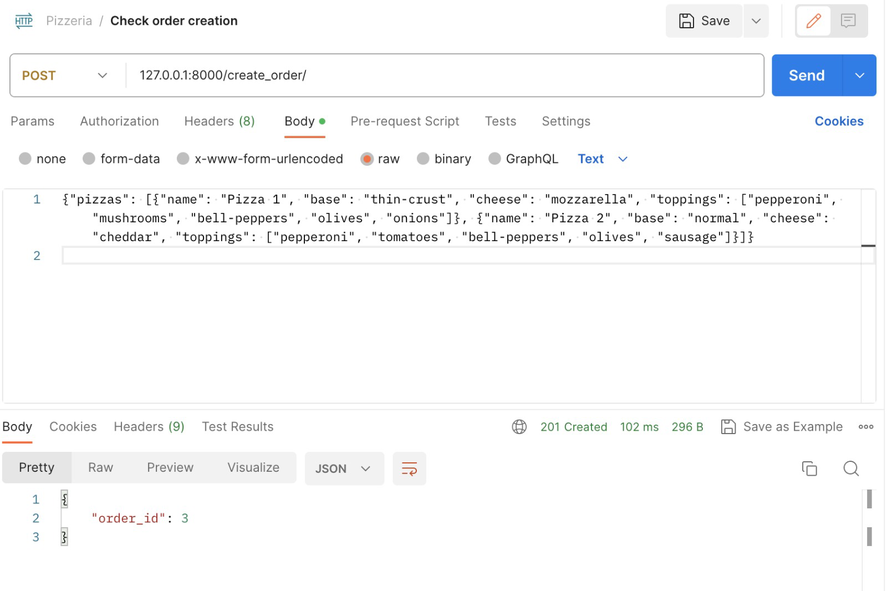
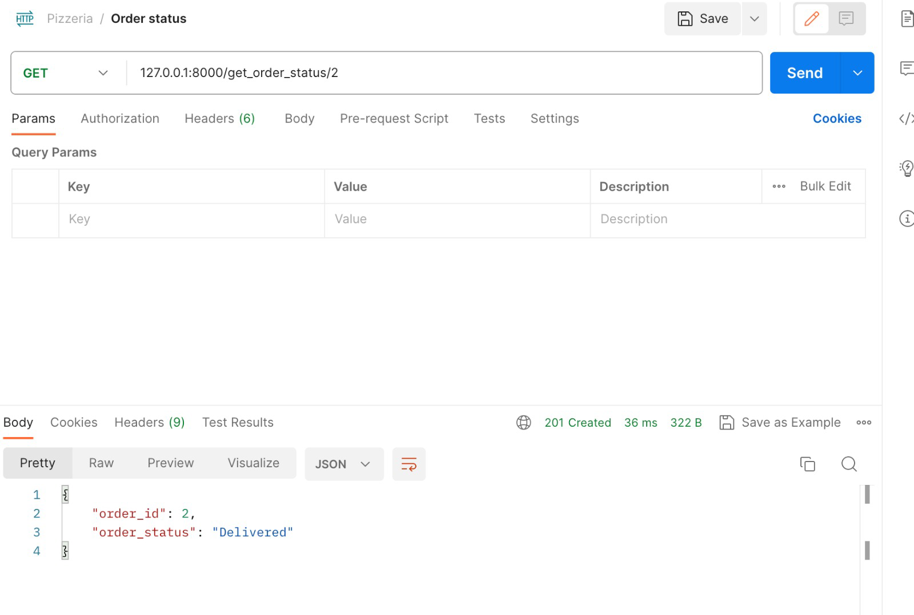
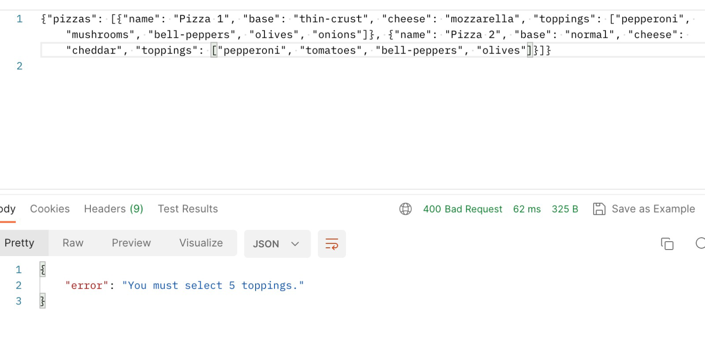
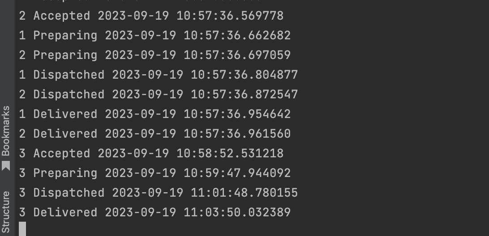
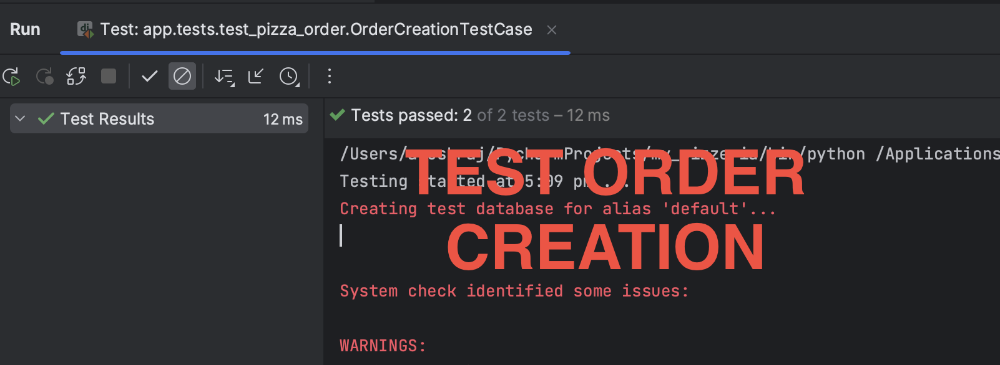
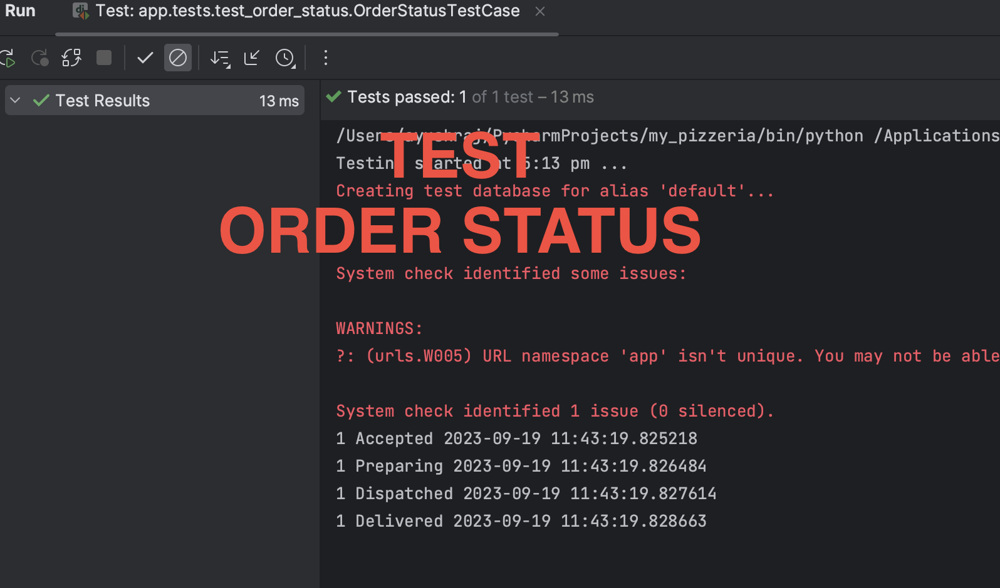

Demo Screenshots attatched -
----------------------------
1. 
2. 
3. 
4. 
5. 
6. 

Code flow AND TESTS -
----------------------
1. app/views.py -> Viewset for create and get order status
2. app/tasks.py -> Background tasks to schedule order status changes based on time. Also to print/log it.
3. app/models.py -> Pizza and Order models with validations
4. app/tests/test_create_status.py -> Test to check creation of order along with validations for invalid ones
5. app/tests/test_create_status.py -> Test change of order status after creation

Execution Setup -
-----------------

1. Download and extract the zip file.

2. Download and install MySQL or install via Terminal - brew install mysql

3. Start MySQL server: brew services start mysql

4. (Optional) Set MySQL Password, MySQL Root Password

5. Install Docker and start docker daemon

6. Host MySQL server on Docker container and expose it to the port 3306. Use commands -  
(Ensure you are in the project home directory) 
Build - docker build -f docker/db/Dockerfile -t pizzeria_db . 
Run - docker run --network=host -it --expose 3306 -p 3306:3306 pizzeria_db 

7. MySQL server is now hosted which automatically created database "pizeria_db"
(If you have setup MySQL Root Password, update the Dockerfile accordingly)

8. Build and run docker for pizzeria app apis and tasks: 
Build - docker build -f docker/apis/Dockerfile -t pizzeria_apis_tasks .        
Run - docker run --network=host -it --expose 8000 -p 8000:8000 pizzeria_apis_tasks      

9. Open Docker Desktop and run a terminal in pizzeria_apis_tasks container
								  OR  
	docker images | grep pizzeria_apis_tasks # Copy id      
	docker run -i -t <id> /bin/bash       

10. Run migrations and run the server:  
	python manage.py makemigrations    
	python manage.py migrate    
	python manage.py runserver 8000    

11. Similary open another terminal to run process_tasks (background tasks):  
	python manage.py process_tasks  

12. Testing:
Open another terminal in pizzeria_apis_tasks container  
    - Api request to Create order:  
    curl -X POST 127.0.0.1:8000/create_order/ -d '{"pizzas": [{"name": "Pizza 1", "base": "thin-crust", "cheese": "mozzarella", "toppings": ["pepperoni", "mushrooms", "bell-peppers", "olives", "onions"]}, {"name": "Pizza 2", "base": "normal", "cheese": "cheddar", "toppings": ["pepperoni", "tomatoes", "bell-peppers", "olives", "sausage"]}]}'
     
     Curl O/P: {
                 "order_id": 1
           }  
     Postman Output Screenshot ->     
   

   - Api request to Fetch order details:  
   curl -L -X GET 127.0.0.1:8000/get_order_status/1  
   Curl O/P: {
			    "order_id": 1,
			    "order_status": "Delivered"
		  }  
   Postman Output Screenshot ->     

   - Api request to create invalid order:  
   curl -X POST 127.0.0.1:8000/create_order/ -d '{"pizzas": [{"name": "Pizza 1", "base": "thin-crust", "cheese": "mozzarella", "toppings": ["pepperoni", "mushrooms", "bell-peppers", "olives", "onions"]}, {"name": "Pizza 2", "base": "normal", "cheese": "cheddar", "toppings": ["pepperoni", "tomatoes", "bell-peppers", "olives"]}]}'
       
   Curl O/P: {			
                "error": "You must select 5 toppings."
          }  
   Postman Output Screenshot ->     

   - Log screenshot of the background tasks  
	 Format : Orderid Status Time  
	 	- Displays how status change after 0, 1, 3 and 5 minutes  
	 Output Screenshot ->   

